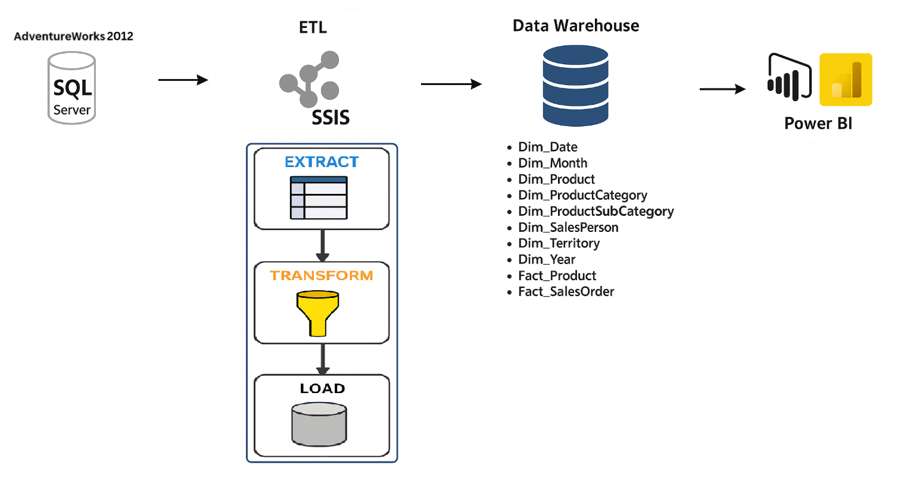

# 📊 Data Warehouse & ETL Pipeline using SSIS



## 🧩 Overview

This system implements an ETL (Extract – Transform – Load) pipeline using **SSIS** to transfer data from the **AdventureWorks 2012** SQL Server database into a structured **Data Warehouse**, which is later used for reporting and analysis in **Power BI**.

---

## 🔄 ETL Process Using SSIS

The ETL flow consists of the following three main stages:

### 1. Extract
- Source: AdventureWorks 2012 (SQL Server)
- Data includes: Orders, Products, Categories, Subcategories, Salespersons, Dates

### 2. Transform
- Data cleaning and normalization
- Data type conversion
- Mapping data to appropriate fact and dimension tables
- Creating calendar and time dimension data

### 3. Load
- Target: Data Warehouse (Star Schema)
- Loaded using SSIS data flow tasks into cleaned and structured tables

---

## 🗃️ Data Warehouse Schema

### Dimension Tables:
- `Dim_Date`
- `Dim_Month`
- `Dim_Year`
- `Dim_Product`
- `Dim_ProductCategory`
- `Dim_ProductSubCategory`
- `Dim_SalesPerson`
- `Dim_Territory`

### Fact Tables:
- `Fact_Product`
- `Fact_SalesOrder`

---

## 📈 Power BI Visualization

- Connects directly to the Data Warehouse
- Provides key visual analytics:
  - Revenue by time, region, product, salesperson
  - Sales performance
  - Trends and growth analytics

---

## 📁 Recommended Folder Structure

```
sales-analystisc-dwh/
│
├── data/
│   └── AdventureWorks2012.bak
│
├── images/
│   └── architecture.png
│
├── powerbi/
│   └── file pbix
│     └── ...
│   └── img-dashboard
│     └── ...
│
├── sql/
│   └── star_schema_diagram.png
│   └── create_db_DataWareHouse.sql
│   └── DWH_Stagging.sql
│   └── DWH_Stagging_Raw.sql
|
├── ssis/
│   └── diagram_screenshots
│     └── ...
│   └── Project_1
│     └── ...
│   └── Project_1.sln
│   
└── README.md
```

---

## 🛠️ Technologies Used

- **SQL Server 2012** (AdventureWorks 2012 DB)
- **SSIS** for ETL development
- **Power BI** for reporting and dashboard
- **T-SQL** for scripting and data manipulation
